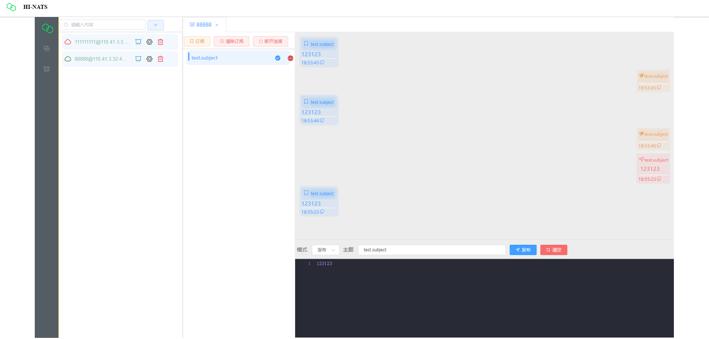

# 
HI-NATS

 HI NATS is a modern lightweight Web Dashboard Tool.

### Feature

+ Super lightweight , nothing any configuration.
+ Only support Websocket client multiple connection.
+ Support Subscribe , Publish , Request mode.
+ Support multiple subscribe.
+ Support nats http monitor real-time data.

### Build Guidelines

#### Prerequisites
+ Vue2
+ Node.js >= 16
+ NPM >= 8

### Run & Deploy with docker
#### 1.clone code
> git clone url
#### 2.install dependency
> npm install
#### 3. build [release](https://github.com/leo-corleone/HI-NATS/releases)
> npm run build
#### 4. download docker nginx image
> docker pull nginx
#### 5. move dist directory to html
> move dist html
#### 6. run nginx container 
> docker run -d -p 80:80 -v /nginx/conf/nginx.conf:/etc/nginx/nginx.conf -v /nginx/html:/usr/share/nginx/html -v /nginx/logs:/var/log/nginx nginx

